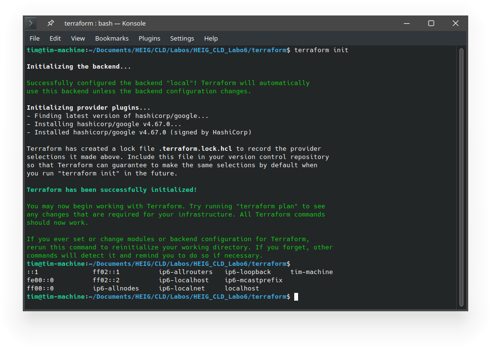
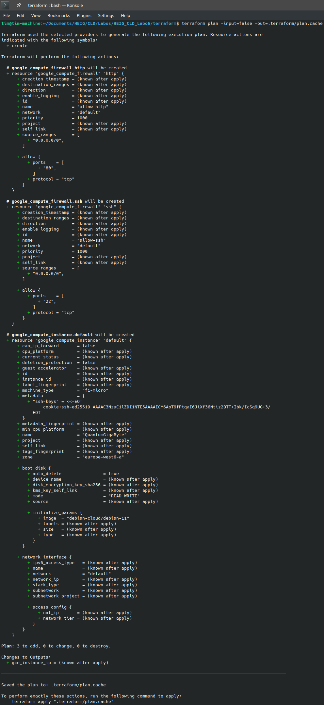
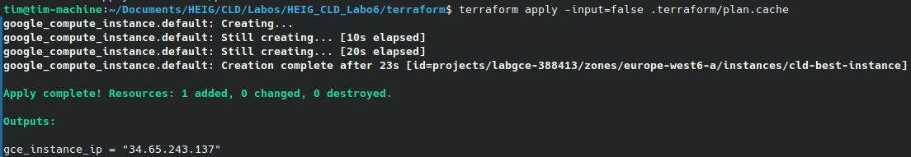
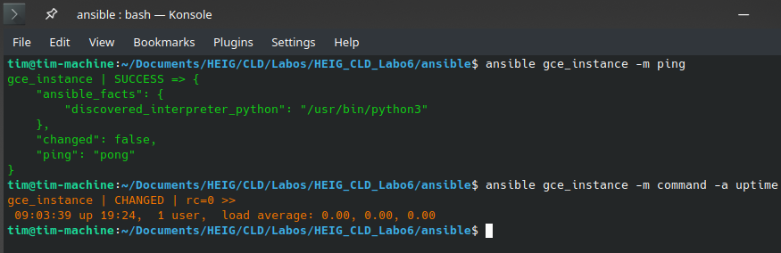
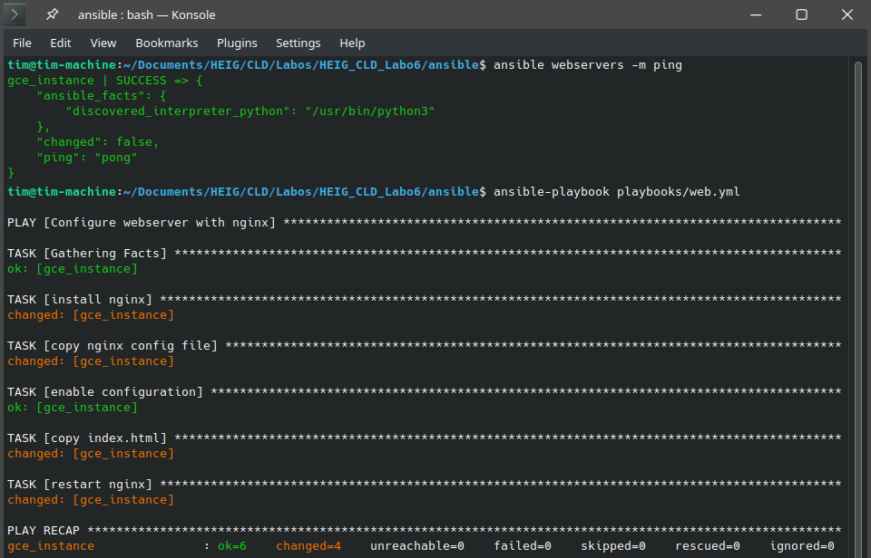
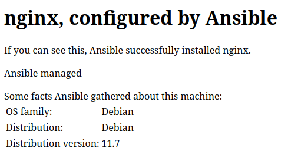
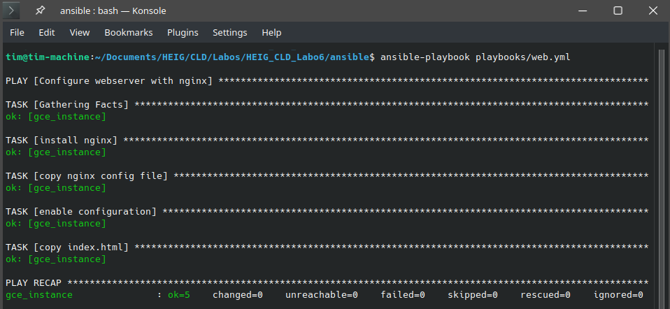
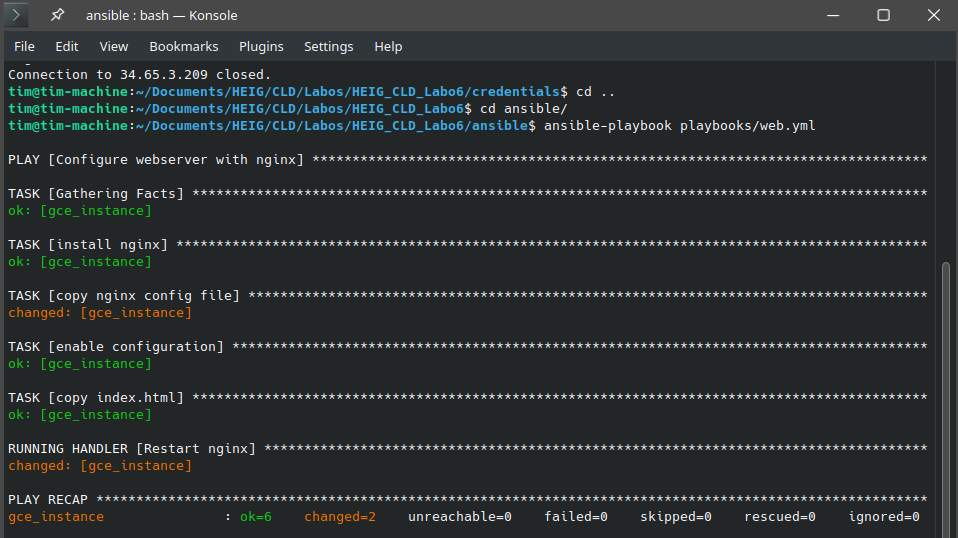

# CLD - LAB06 : Infrastructure-as-code and configuration management - Terraform, Ansible and Gitlab
**Group S : A. David, T. Van Hove**

**Date : 01.06.2023**

**Teacher : Prof. Marcel Graf**

**Assistant : Rémi Poulard**

In this lab, we are going to deploy a website running in the cloud and using Terraform and Ansible, tools that use the principle of infrastructure as code. We'll be using NGINX and Google Cloud technologies.

In the first part of this lab, we're going to provision the cloud infrastructure. In other words, we'll create the necessary resources on the cloud.

In the second part, we'll configure the virtual machine by installing a web server and configuration files. To do this, we'll use Ansible.

In the third part, which is optional, we'll use Terraform as a team. The solution will be to store the state of Terraform in a version control system.

### Table of content

[toc]

# Task 1: Install Terraform

We installed Terraform on our laptop based on Ubuntu.


# Task 2: Create a cloud infrastructure on Google Compute Engine with Terraform

The project-IDs :

- **labgce-388816**  For Anthony account
- **labgce-388413** For Tim account


Firs, we added the variables values in the terraform.tfvar file. Then we initialized terraform:



Then, we created a terraform plan:




Finally, we validated the plan:




> Explain the usage of each provided file and its contents by directly  adding comments in the file as needed (we must ensure that you  understood what you have done). In the file `variables.tf` fill the missing documentation parts and link to the online documentation. Copy the modified files to the report.


backend.tf:

```hcl
terraform {
  backend "local" {
    # Local backend stores state files on the local filesystem
    # Adjust the backend configuration as needed (e.g., for remote state storage)
  }
}
```


main.tf:

```hcl
# Defines the provider for Google Cloud Platform
provider "google" {
  project     = var.gcp_project_id  # The GCP project ID
  region      = "europe-west6-a"    # The desired region for resources
  credentials = file("${var.gcp_service_account_key_file_path}")  # Path to GCP service account key file
}

# Resource: Google Compute Engine instance
resource "google_compute_instance" "default" {
  name         = var.gce_instance_name  # Name of the GCE instance
  machine_type = "f1-micro"             # Machine type for the instance
  zone         = "europe-west6-a"       # Zone for the instance

  metadata = {
    # Set the SSH key for the instance
    ssh-keys = "${var.gce_instance_user}:${file("${var.gce_ssh_pub_key_file_path}")}"
  }
  
  # Boot disk image for the instance
  boot_disk {
    initialize_params {
      image = "debian-cloud/debian-11"
    }
  }

  # Network for the instance
  network_interface {
    network = "default"

    access_config {
      # Include this section to give the VM an external IP address
    }
  }
}

# Resource: Google Compute Engine firewall for SSH
resource "google_compute_firewall" "ssh" {
  name          = "allow-ssh"   # Name of the firewall rule
  network       = "default"     # Network for the firewall rule
  source_ranges = ["0.0.0.0/0"] # Source IP ranges allowed to access

  allow {
    ports    = ["22"]   # Allowed SSH port
    protocol = "tcp"   # Protocol for the firewall rule
  }
}

# Resource: Google Compute Engine firewall for HTTP
resource "google_compute_firewall" "http" {
  name          = "allow-http"   # Name of the firewall rule
  network       = "default"      # Network for the firewall rule
  source_ranges = ["0.0.0.0/0"]  # Source IP ranges allowed to access

  allow {
    ports    = ["80"]   # Allowed HTTP port
    protocol = "tcp"   # Protocol for the firewall rule
  }
}
```


outputs.ft:

```hcl
# Output: GCE instance IP address
output "gce_instance_ip" {
  value = google_compute_instance.default.network_interface.0.access_config.0.nat_ip
}
```


variables.tf:

```hcl
variable "gcp_project_id" {
  description = "The ID of the Google Cloud Platform project"
  type        = string
  nullable    = false
  # Documentation: https://developer.hashicorp.com/terraform/language/values/variables
}

variable "gcp_service_account_key_file_path" {
  description = "The file path to the GCP service account key file"
  type        = string
  nullable    = false
  # Documentation: https://developer.hashicorp.com/terraform/language/values/variables
}

variable "gce_instance_name" {
  description = "The name of the Google Compute Engine instance"
  type        = string
  nullable    = false
  # Documentation: https://developer.hashicorp.com/terraform/language/values/variables
}

variable "gce_instance_user" {
  description = "The username for SSH access to the GCE instance"
  type        = string
  nullable    = false
  # Documentation: https://developer.hashicorp.com/terraform/language/values/variables
}

variable "gce_ssh_pub_key_file_path" {
  description = "The file path to the SSH public key file"
  type        = string
  nullable    = false
  # Documentation: https://developer.hashicorp.com/terraform/language/values/variables
}

```


terraform.tfvars:

```hcl
gcp_project_id = "labgce-388413"
gcp_service_account_key_file_path = "../credentials/labgce-388413-0359dba88e1b.json"
gce_instance_name = "cld-best-instance"
gce_instance_user = "cookie"
gce_ssh_pub_key_file_path = "../credentials/labgce-ssh-key.pub"
```


> Explain what the files created by Terraform are used for.

When we do a `terraform init`, it will create 1 directory and 4 files:

1. `.terraform/`: This directory is created at the root of the Terraform working directory and contains all the necessary files for the Terraform backend and provider plugins.
2. `.terraform.lock.hcl`: This file records the exact versions of the provider plugins used for the configuration. It ensures reproducibility and consistency when working with Terraform.
3. `terraform.tfstate` : If we are using a local backend, Terraform may create this file to store the state of our infrastructure. However, if we are using a remote backend, the state file is typically stored remotely and not created locally.
4. `terraform.tfstate.backup` : If a previous state file exists, Terraform may create a backup of it with this filename. The backup file helps protect against accidental loss or corruption of the state file.


> Where is the Terraform state saved? 

By default, the Terraform state is stored in locally a file name `terraform.state`. 


> Imagine you are working in a team  and the other team members want to use Terraform, too, to manage the  cloud infrastructure. Do you see any problems with this? Explain.

1. When multiple people simultaneously modify the infrastructure, conflicts can appear when committing and merging changes to the Git repository. Since the state file is binary and changes frequently, it can cause conflicts and difficulties in resolving them.
2. Storing the state file in Git requires continuous synchronization between team members. Each team member needs to ensure they have the latest state file before running Terraform commands.
3. The Terraform state file may contain sensitive information, such as resource IDs, credentials, and private IP addresses. Storing it in a Git repository potentially exposes this sensitive information to  unauthorized access.

To solve these problems, we could use a remote backend for storing the Terraform state, such as Terraform Cloud, AWS S3, or Azure Blob Storage. This can provide a centralized and secure storage solution for the state file. It enables better collaboration, concurrency control, and automatic versioning. Each team  member can access the state file without relying on Git synchronization, and sensitive information is protected in a more secure manner.


> What happens if you reapply the configuration (1) without changing `main.tf` (2) with a change in `main.tf`? Do you see any changes in Terraform's output? Why?

(1) If we reapply the configuration whitout making any changes to the `main.tf` file on our Terraform project, it will detect that there are no changes to apply and will simply refresh the state of our infrastructure. This means that it will query the current state of our ressources and update the Terraform status file accordingly, but itl will not make any changes to out infrastructure.

(2) If we make a change to the `maint.tf` file, Terraform will detect the change in the configuration file and compare it to the current state of the infrastructure. Depending on the nature of the change, Terraform may need to modify or recreate resources to align with the updated configuration. The Terraform output will display the changes it plans to make, such as creating new resources, modifying existing resources, or destroying and recreating resources as needed.


> Can you think of examples where Terraform needs to delete parts of the infrastructure to be able to reconfigure it?

Sometimes, Terraform determines that the existing resources do not match the desired configuration, and must takes the necessary steps to reconcile the infrastructure with the new state. For example:

1. If we change the type of a resource in the configuration (e.g., from an EC2 instance to an RDS database), Terraform needs to delete the existing resource and create a new one to run the change.
2. When we modify certain attributes of a resource, such as changing the size or configuration of an instance, Terraform may need to destroy and recreate the resource to apply the changes.
3. If we remove a resource from the configuration, Terraform will plan to delete the corresponding resource from the infrastructure to ensure it aligns with the desired state.
4. If we modify the dependencies between resources, Terraform may need to update the order in which it creates or modifies resources. This can result in deleting and recreating resources to reflect the new dependencies.


> Explain what you would need to do to manage multiple instances.

In our `main.tf` file, we can define multiple resource blocks for each VM instance we want to create. Each resource block represents an individual VM configuration, for example:

```
resource "google_compute_instance" "instance1" {
  # Configuration for instance 1
}

resource "google_compute_instance" "instance2" {
  # Configuration for instance 2
}
```

To create multiple instances more dynamically, we can leverage loops or dynamic expressions. We can use the `count` parameter in resource blocks or the `for_each` parameter to iterate over a list or map of instance configurations. Example with `count`:
```
resource "google_compute_instance" "instance" {
  count = 3

  # Configuration for each instance
}
```

Example with `for_each`:
```
variable "instances" {
  description = "Map of instance configurations"
  type        = map(object({
    # Define instance configuration attributes
  }))
  default = {
    "instance1" = { ... },
    "instance2" = { ... },
  }
}

resource "google_compute_instance" "instance" {
  for_each = var.instances

  # Configuration for each instance
}
```

If we have multiple instances with different configurations, we can  manage variables for each instance by defining them in a separate file or data structure. This allows to specify instance-specific values and easily update the configurations.

As we responded in the previous question, we can set up a remote state backend for improved collaboration and shared state management.

Now, to manage the instances, we can make changes to the configuration (e.g. instance type, security groups, etc.) and apply these changes using `terraform apply`. Terraform will update existing instances in line with the configuration changes.

Finally, if we want to delete specific instances, we have 2 options:

Option 1: Remove Resource Block by simply deleting the  the resource block in our `main.tf` file that corresponds to the instance you want to delete, then run `terraform plan` and `terraform apply`. Terraform will identify that the instance needs to be deleted and handle the removal accordingly.

Option 2: Run `terraform destroy -target=<resource_address>` . This allows us to specifically target and delete a specific resource without modifying the configuration file. This approach is useful when we want to delete a resource without removing its resource block from the configuration permanently.


> Take a screenshot of the Google Cloud Console showing your Google Compute instance and put it in the report.


# Task 3: Install Ansible

We followed the instructions for installing Ansible and everything went smoothly.

Note that we had to set up a virtual Python environment that we named `ansible-env`.


# Task 4: Configure Ansible to connect to the managed VM

Here is the ansible.cfg file content:

```
[defaults]
inventory = hosts
remote_user = cookie
private_key_file = ../credentials/labgce-ssh-key
host_key_checking = false
deprecation_warnings = false
```


Here is the hosts file content:

```
 gce_instance ansible_ssh_host=34.65.3.209
```


Here is a screenshot of the ping and uptime commands:



# 

> What happens if the  infrastructure is deleted and then recreated with Terraform? What needs  to be updated to access the infrastructure again?

When the infrastructure is recreated, the public IP address of the managed VM might change. We would need to update the `hosts` file with the new public IP address.


# Task 5: Install a web server and configure a web site

We didn't encounter any difficulty doing this part. After copying the files in the directory, we launched succesfully the playbook:




> Explain the usage of each file and its contents, add comments to  the different blocks if needed (we must ensure that you understood what  you have done). Link to the online documentation.

`web.yml`:

Defines the tasks to configure the webserver with nginx. It specifies that the tasks should be executed on the hosts belonging to the `webservers` group. It uses the `apt` module to install nginx, copies configuration files, templates, and restarts the nginx service.

```yaml
- name: Configure webserver with nginx    # Name of the playbook
  hosts: webservers                       # Target hosts
  become: True                            # Use elevated privileges (sudo)
  tasks:                                  # List of tasks to perform
  
# Task 1: Install nginx
# Use the 'apt' module to install nginx
    - name: install nginx    
      apt: name=nginx update_cache=yes

# Task 2: Copy nginx conf file to target host
# Use the 'copy' module to copy the nginx.conf file from the local 'files' directory to the target host's location.
   - name: copy nginx config file        
      copy: src=files/nginx.conf dest=/etc/nginx/sites-available/default  

# Task 3: Create a symbolic link for the nginx configuration file in 'sites-enabled' directory
# Use the 'file' module to ensure the symbolic link exists. This will enable the nginx configuration.
    - name: enable configuration          
      file: >
        dest=/etc/nginx/sites-enabled/default
        src=/etc/nginx/sites-available/default
        state=link   
        
# Task 4: Copy the index.html file to the target host's nginx document root
# Use the 'template' module to render the 'index.html.j2' file from the local 'templates' directory and copy it to the target host's location.
    - name: copy index.html               
      template: src=templates/index.html.j2 dest=/usr/share/nginx/html/index.html mode=0644

# Task 5: Restart the nginx service
# Use the 'service' module to ensure the nginx service is restarted, thus activating the new configuration.
    - name: restart nginx                 
      service: name=nginx state=restarted 
```

Documentation: 

- Apt: https://docs.ansible.com/ansible/latest/collections/ansible/builtin/apt_module.html
- Copy: https://docs.ansible.com/ansible/latest/collections/ansible/builtin/copy_module.html
- Files: https://docs.ansible.com/ansible/latest/collections/ansible/builtin/file_module.html
- Templates: https://docs.ansible.com/ansible/latest/collections/ansible/builtin/template_module.html
- Service: https://docs.ansible.com/ansible/latest/collections/ansible/builtin/service_module.html

`nginx.conf`:

Contains the configuration for the nginx web server. It defines the server block with the `listen` directive, `root` directory, and other settings.

```bash
server {
	# Listens on port 80. The 'default_server' option makes this server block the default.
    listen 80 default_server;
    
    # Also listen on IPv6 addresses.
    listen [::]:80 default_server ipv6only=on;
    
	# Document root - where the web files are located.
    root /usr/share/nginx/html;
    
    # Default files to serve if a directory is requested.
    index index.html index.htm;            

	# Server name. This is useful for serving different content for different domains.
    server_name localhost;                 

	# For requests to the root directory or any subdirectory, try to serve the file or 		directory that was requested. If it doesn't exist, return a 404 error.
    location / {                           
        try_files $uri $uri/ =404;
    }
}

```

Documentation :  https://nginx.org/en/docs/beginners_guide.html


`index.html.j2`:

Jinja2 template for the `index.html` file. It will be rendered by Ansible's `template` module. Jinja2 is a  templating language for Python, modeled after Django’s templates. It's used to dynamically create configuration files for applications based on variables. It is  useful with Ansible to generate different configuration files for different systems, with different settings based on the host, environment, or other factors.

```HTML
<html>
    <head>
    <title>Welcome to ansible</title> </head>
    <body>
    <h1>nginx, configured by Ansible</h1>
    <p>If you can see this, Ansible successfully installed nginx.</p>
    <!-- Will be replaced with a string that tells how this file is managed by Ansible -->
    <p>{{ ansible_managed }}</p> 
    <p>Some facts Ansible gathered about this machine:
    <table>
        <!-- The OS family will be dynamically filled by Ansible -->
        <tr><td>OS family:</td><td>{{ ansible_os_family }}</td></tr>
        
        <!-- The OS distribution will be dynamically filled by Ansible -->
        <tr><td>Distribution:</td><td>{{ ansible_distribution }}</td></tr>
        
        <!-- The OS distribution version will be dynamically filled by Ansible. -->
        <tr><td>Distribution version:</td><td>{{ ansible_distribution_version }}</td></tr> 
    </table>
    </p>
    </body>
</html>
```

Documentation: https://docs.ansible.com/ansible/latest/playbook_guide/playbooks_templating.html


> Copy your hosts file into your report.

`hosts`:

```
[webservers]
gce_instance ansible_ssh_host=34.65.3.209
```


Here is a screenshot of the website we deployed on the instance:




# Task 6: Adding a handler for NGINX restart


Handlers are just like regular tasks, but they run only if notified by another task. If a task returns 'changed', then all of the 'notify' directives (which are  referenced by the handler's name) will be triggered. Appart from a problem in the indentation of the playbook, we didn't encounter any problems deploying it:



> Copy the modified playbook into your report.

```yaml
- name: Configure webserver with nginx
  hosts: webservers
  become: True
  tasks:
    - name: install nginx
      apt: name=nginx update_cache=yes

    - name: copy nginx config file
      copy: 
        src: files/nginx.conf 
        dest: /etc/nginx/sites-available/default
      notify: Restart nginx # Notify the handler whenever this task changes something

    - name: enable configuration
      file: 
        dest: /etc/nginx/sites-enabled/default
        src: /etc/nginx/sites-available/default
        state: link
      notify: Restart nginx # Notify the handler whenever this task changes something

    - name: copy index.html
      template: 
        src: templates/index.html.j2 
        dest: /usr/share/nginx/html/index.html 
        mode: 0644
      notify: Restart nginx # Notify the handler whenever this task changes something

  handlers:
    - name: Restart nginx  # Define the handler
      service: 
        name: nginx 
        state: restarted

```

In this setup, the handler "Restart nginx" is notified whenever the  nginx configuration file is copied, the configuration is enabled, or the index.html file is copied. If any of these tasks lead to a change, the  handler will be triggered, and nginx will be restarted.

Documentation: https://docs.ansible.com/ansible/latest/playbook_guide/playbooks_handlers.html#handlers


# Task 7: Test Desired State Configuration principles


> Return to the output of running the *web.yml* playbook the first time. There is one additional task that was not in the playbook. Which one? Among the tasks that are in the playbook there is one task that Ansible marked as *ok*. Which one? Do you have a possible explanation?

Here is the output:


The additional task that was not in the playbook but is present in the output is "Gathering Facts". When Ansible runs, it will first gather facts about the systems it is managing before executing tasks. These facts are details about the system, such as network interfaces, operating system, IP addresses, etc. This information can then be used in our Ansible playbooks. This task is performed by default, unless explicitly skipped.

Reference: [Ansible facts](https://docs.ansible.com/ansible/latest/user_guide/playbooks_vars_facts.html)

The task marked as 'ok' is "enable configuration". When we run the playbook for the first time, the "enable configuration" task is marked as 'ok' because the `state` parameter of the `file` module in this task is set to `link`. In Ansible, the `file` module with `state: link` ensures a symbolic link exists. If the symbolic link at the specified `dest` path already exists in the system image provided by Google Cloud , then Ansible will report this task as 'ok' because the desired state is already present, hence no changes are needed.

Reference: [Ansible file module](https://docs.ansible.com/ansible/latest/collections/ansible/builtin/file_module.html)


> Re-run the *web.yml* playbook a second time. In principle nothing should have changed. Compare Ansible's output with the first run. Which tasks are marked as changed?

No tasks were marked as "changed" during the second run of the `web.yml` playbook. Here is the output:


> SSH into the managed server. Modify the NGINX configuration file */etc/nginx/sites-available/default*, for example by adding a line with a comment. Re-run the playbook. What does Ansible do to the file and what does it show in its output?

Here is the output:


We can see that the task "copy nginx config file" is marked as "changed". When we manually added a comment line in the `/etc/nginx/sites-available/default` file, we altered the state of the file on the remote machine. On the next run of the playbook, Ansible detected this difference between the desired state (as defined in your playbook) and the actual state on the remote machine. In order to achieve the desired state, Ansible overwrote the file on the remote machine with the version from your control node. 

Moreover, as you we configured a handler to restart nginx whenever the nginx configuration file changes, the handler "Restart nginx" is also executed and marked as "changed".


> Do something more drastic like completely removing the homepage and repeat the previous question.

We deleted the default file. We had the exact same output as before. The result is the same as before, with the same explanation. We altered the state of the file => Ansible detected the difference => marked it as changed.


> What is the differences between Terraform and Ansible? Can they both achieve the same goal?

Terraform and Ansible are used for different purposes and have some distinct characteristics. They can sometimes overlap in functionality, but are used in conjunction to manage different stages of infrastructure lifecycle.

Terraform is not configuration management tool, it doesn't care about the state of our machines, it cares about the state of the infrastructure. It manages resources such as compute instances, storage, and networking in a declarative manner. It maintains a state of the infrastructure and allows for reproducible deployments.

Ansible is primarily a configuration management tool, it cares about the state of the machines and how to get them into the desired state. It can interact with cloud services, but its strength is in managing applications and system configuration on existing servers.


> List the advantages and disadvantages of managing your  infrastructure with Terraform/Ansible vs. manually managing your  infrastructure. In which cases is one or the other solution more  suitable?

Advantages:

1. Speed & Efficiency: Automation allows for quick and repeatable deployments. This consistency reduces the potential for human error and ensures that deployments happen smoothly and efficiently.
2. Scalability: Managing a large number of servers manually can quickly become unmanageable. With automation tools, you can easily manage a large infrastructure with less effort.
3. Consistency & Reproducibility: Since the infrastructure is defined as code, it can be versioned and reviewed like any other code. This ensures that the infrastructure is consistent and reproducible.
4. Collaboration: The Infrastructure as Code approach makes it easier for teams to understand and collaborate on infrastructure configuration.

Disadvantages of using Terraform/Ansible:

1. Learning curve: These tools have their own language and syntax which require time to learn.
2. Complexity: For smaller, simpler environments, using these tools could add unnecessary complexity.
3. Risk of over-reliance: There's a risk of becoming over-reliant on these tools, which can be problematic if there's a need to troubleshoot or intervene manually.


> Suppose you now have a web server in production that you have  configured using Ansible. You are working in the IT department of a company and some of your system administrator colleagues who don't use  Ansible have logged manually into some of the servers to fix certain things. You don't know what they did exactly. What do you need to do to bring all the server again to the initial state? We'll exclude drastic changes by your colleagues for this question.

Ansible is designed to be idempotent, this means that if we run our Ansible playbook again, it will restore the servers to the desired state as defined in the playbook.

So:

1. Double-check our Ansible playbook to make sure it's up to date and contains all the configurations we need for our servers.
2. Execute the playbook against all the servers that our colleagues have manually modified. This should return the servers to the state as defined in the playbook. 
3. Review the output from the Ansible playbook run. Any tasks that result in "changed" indicate that Ansible has performed an action on that server to bring it back into the desired state.

This assumes that our playbook covers all the configurations necessary to restore the servers to their initial state. If not, we may need to enhance the playbook to cover more configurations.

Finally, If our colleagues made fixes, that means that something was not working corectly. So after restoring the servers, we should add the fixes to the playbook, and teach how to use Ansible to our dearest colleagues.

# Task 8 (optionnal) : Configure your infrastructure using a CI/CD Pipeline

 

> Explain the usage of each file and its contents, add comments to  the different blocks if needed (we must ensure that you understood what  you have done). Link to the online documentation.


> Explain what CI/CD stands for.


> Where is the Terraform state saved? Paste a screenshot where you can see the state with its details in GitLab.


>  Paste a link to your GitLab repository as well as a link to a  successful end-to-end pipeline (creation, configuration and destruction  of your infrastructure).


> Why are some steps manual? What do we try to prevent here?


> List the advantages and disadvantages of managing your  infrastructure locally or on a platform such as GitLab. In which cases  is one or the other solution more suitable?
